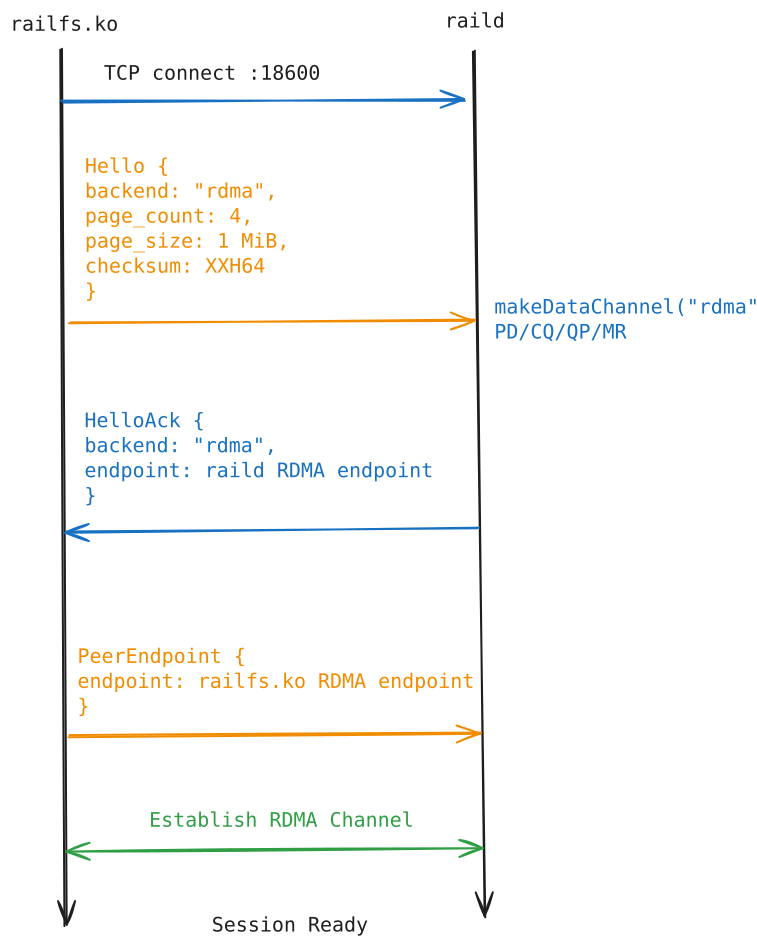
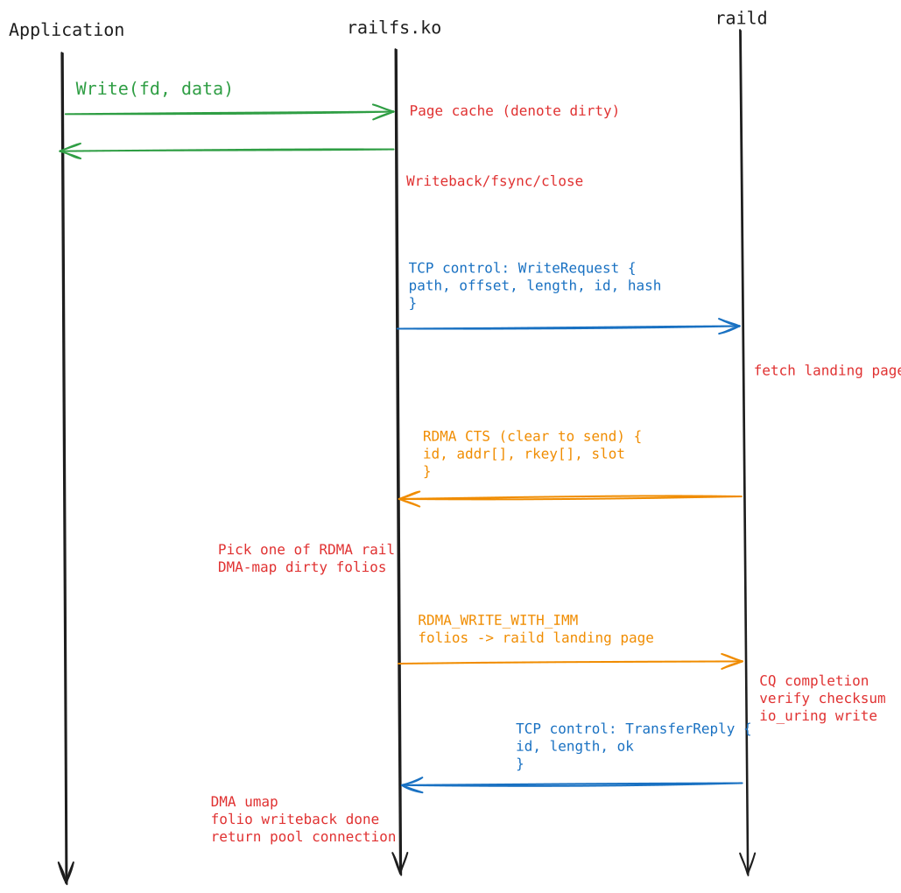
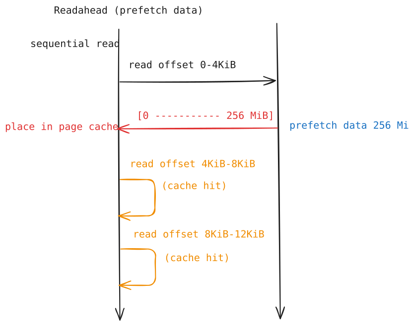

# Transport


## Handshake

Hello Message

```c
struct Hello {
    uint16_t version;
    string   backend;
    uint32_t block_size;
    uint64_t page_count;
    uint64_t page_size;
    uint64_t window_pages;
    bool     recursive;
    bool     verify;
    uint8_t  checksum;
};
```

Control Frame

```c
struct ControlFrame {
    uint32_t magic;          // 0x5241494c (RAIL)
    uint16_t type;           // HELLO = 1
    uint32_t payload_length;
    uint8_t  payload[];      // Hello
};
```

<p align="center">
  
</p>

## RDMA Transport

<p align="center">
  
</p>

## Readahead

<p align="center">
  
</p>
