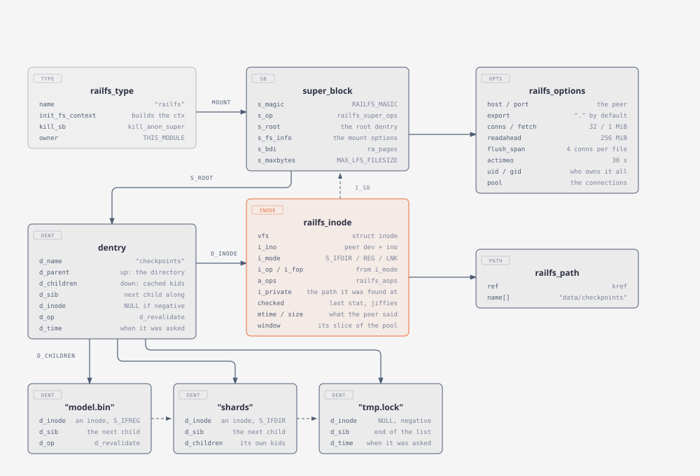
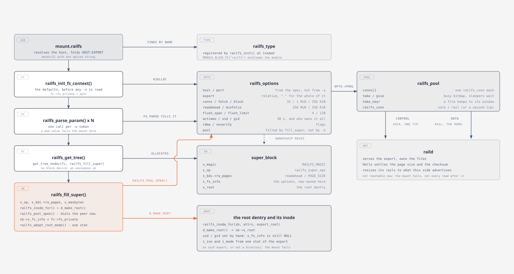
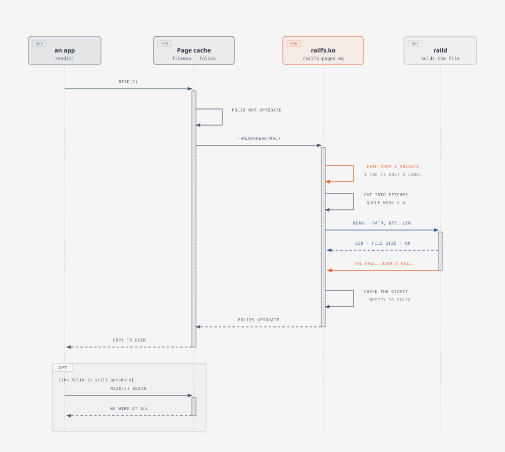

# Virtual Filesystem (VFS)

The VFS is the interface the kernel puts in front of every filesystem - ext4 and
btrfs on a disk, NFS and SMB over a network. A filesystem fills in the operation
tables; the VFS does the path walking, the caching and the syscall plumbing.

Railfs is one of the network kind. Using more than one NIC usually means bonding
the links, which RDMA devices often cannot do, so railfs bonds nothing: a mount
builds a rail on every fabric port that is up and spreads pages across them. The
balancing is the client's policy, the way NCCL and NIXL do it, rather than a
property of how the fabric was set up.



Per mount, everything hangs off `s_fs_info`. Per file, everything hangs off the
inode - the type in `i_mode`, which picks the operation tables, and the path in
`i_private`, which is the only handle the daemon accepts.


## Mount

A mount takes two pieces: the kernel module [`railfs.ko`](../../../src/linux) and
the userspace helper [`mount.railfs`](../../../tools/mount.railfs/main.c). Load
the one, install the other, and a railfs export mounts like any other filesystem:

```bash
sudo insmod build/src/linux/railfs.ko
sudo cp build/tools/mount.railfs/mount.railfs /sbin/
sudo mount -t railfs <peer>:/ /mnt -o rdma,uid=$(id -u),gid=$(id -g)
```

`insmod` only registers the type; nothing talks to the peer until the `mount`.
That third line is what `mount(8)` hands to `/sbin/mount.railfs`, which resolves
the host, folds `HOST:EXPORT` into the one option string the kernel parses, and
calls `mount(2)`.

From there the mount is a small state machine on an `fs_context`:
`init_fs_context` allocates a `railfs_options` with the defaults, `parse_param`
runs once per `-o` token, `get_tree` asks for an anonymous superblock, and
`fill_super` does the work - the root inode and its dentry, the connection pool,
and the handover of the options to `sb->s_fs_info`.



`fill_super` dials the peer, so a dead daemon fails `mount` itself. Connecting
lazily would give a mount that looks fine until every read fails.

## Inode

A `dentry` binds one name to one inode, and together they are the tree the
kernel walks: `d_parent` up to the directory, `d_children` down to the names
looked up so far, `d_sib` along to the next one. Names live only here - an inode
has no idea what it is called.

That tree is a cache, not the directory. It holds what has been looked up and
not yet evicted, and a name the peer did not have is cached too - as a dentry
with no inode - so opening a missing file twice only asks the peer once.

`struct inode` is the file itself - its metadata, and where the data lives. On
ext4 that second part is `i_block[]`, a list of disk blocks. Railfs has no
blocks to point at, so it keeps the path the peer resolves in `i_private` and
asks for a range of that instead. The inode number is only a label reported to
userspace; nothing looks a file up by it.



Reads go through the page cache like on any other filesystem. What railfs adds
is the middle of the figure: one readahead window becomes several fetches, each
a control frame on the socket and a page back over a rail.
